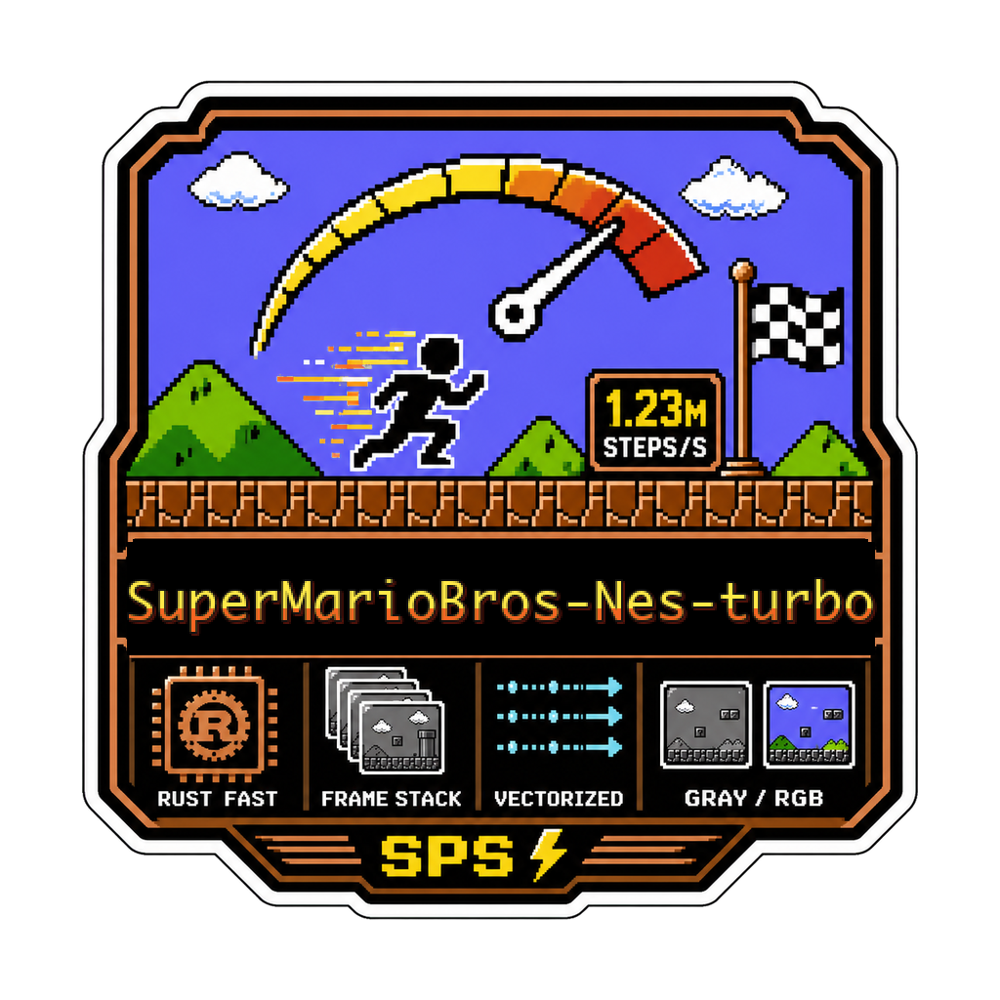

<div align="center">
  

  **🚀 Blazing fast SuperMarioBros-Nes environment for RL research 🍄**
</div>

`SuperMarioBros-Nes-turbo` is a local Python package for running fast Super Mario Bros NES reinforcement-learning environments. It is for RL researchers and experimenters who need many CPU rollout steps without going through a general-purpose emulator stack. You use it by building the Rust extension, pointing it at your own ROM, then importing `supermarioemu` or running the benchmark scripts.

The package exposes a Gymnasium-style single-env wrapper and a vectorized batch API. The hot path crosses from Python to Rust once per batched step, while frame skip, reward extraction, termination checks, preprocessing, frame stacking, and observation-buffer writes stay in Rust.

## Install

```bash
git clone https://github.com/tsilva/SuperMarioBros-Nes-turbo.git
cd SuperMarioBros-Nes-turbo
uv sync --extra dev
uv run maturin develop --release
```

Point the scripts at a local SuperMarioBros-Nes ROM. The ROM is not included in this repository. The default script path is:

```bash
~/Desktop/roms/NES/mapper-000-NROM/SuperMarioBros-Nes-v0.nes
```

Pass `--rom-path` to use a different file. Verify the expected ROM with:

```bash
shasum -a 256 ~/Desktop/roms/NES/mapper-000-NROM/SuperMarioBros-Nes-v0.nes
```

Expected SHA-256:

```text
f61548fdf1670cffefcc4f0b7bdcdd9eaba0c226e3b74f8666071496988248de
```

Import the package as `supermarioemu`:

```python
import numpy as np

from supermarioemu import SuperMarioBrosVecEnv

env = SuperMarioBrosVecEnv(
    rom_path="~/Desktop/roms/NES/mapper-000-NROM/SuperMarioBros-Nes-v0.nes",
    num_envs=64,
    frame_skip=4,
    grayscale=True,
    frame_stack=4,
    crop_top=32,
    resize_width=84,
    resize_height=84,
)

obs = env.reset()
actions = np.zeros((env.num_envs,), dtype=np.uint8)
env.step_async(actions)
obs, rewards, terminated, truncated, infos = env.step_wait()
```

`step_wait()` calls the Rust `FastMarioVecEnv` once for the whole batch and fills reusable NumPy arrays in place. Use `step_fast()` when you do not need per-env `info` dictionaries.

## Commands

```bash
uv sync --extra dev                 # install Python dev dependencies
uv run maturin develop --release    # build and install the Rust extension

uv run python scripts/smoke_smb.py  # quick ROM/emulator smoke check
uv run python scripts/benchmark_vec_env.py --num-envs 8 --frame-skip 4 --frame-stack 4
uv run python scripts/benchmark_sps.py --state Level1-1 --num-envs 16 --steps 500 --repeats 3

uv run python scripts/play.py --mode external      # raw SDL2 play view
uv run python scripts/play.py --mode external --view preprocessed --scale 4

modal run scripts/modal_benchmark_sps.py --output-json artifacts/benchmarks/modal-baseline.json
```

## Notes

- Python `>=3.9` and a Rust toolchain are required to build the Maturin extension.
- The current emulator scope is SuperMarioBros-Nes mapper 0 NROM.
- The Python package exposes `SuperMarioBrosEnv`, `SuperMarioBrosVecEnv`, and `ACTION_MEANINGS`.
- The default action set is `noop`, `right`, `right_b`, `right_a`, `right_a_b`, `a`, `left`, and `start`.
- Use `--state Level1-1` or another stable-retro state to start from a saved level state. If needed, pass `--state-dir` or set `SUPERMARIOEMU_STATE_DIR`.
- Benchmark JSON can be written with `scripts/benchmark_sps.py --output-json ...`.
- The Modal benchmark path expects `modal` to be installed and authenticated outside this package. It sends the local ROM and state bytes to the remote container at run time and defaults to `Level1-1`, `Level1-2`, `Level1-3`, and `Level1-4`.
- Play mode uses the native SDL2 library. If SDL2 is not installed or discoverable, `scripts/play.py` exits with an SDL backend error.
- ROM files are not included in the repository; use the SHA-256 digest above to confirm you are testing with the expected ROM.

## Architecture


## License

MIT, as declared in [pyproject.toml](./pyproject.toml) and [Cargo.toml](./Cargo.toml).
